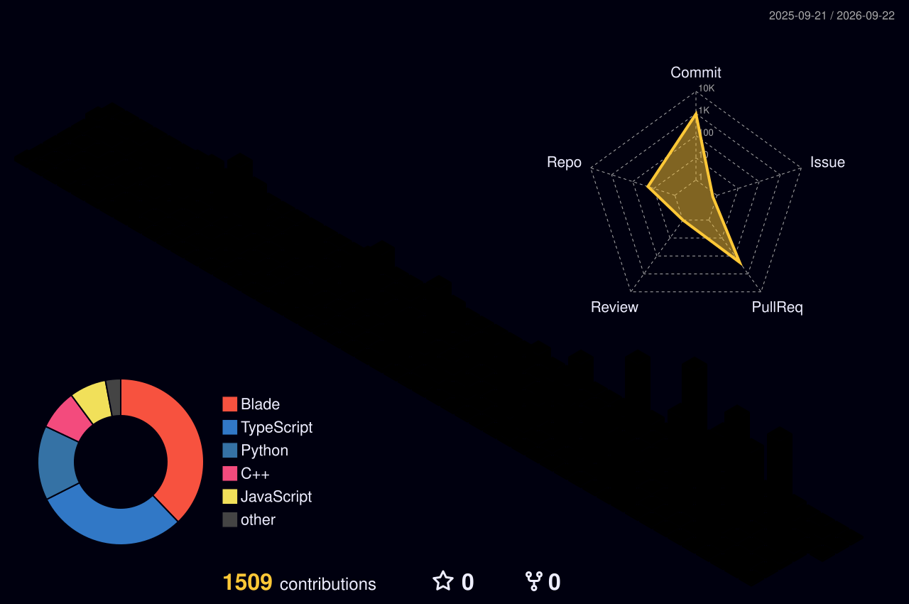

<!--
╔══════════════════════════════════════════════════════════════════════════════╗
║  hum4id · GitHub Profile README                                              ║
║  Cara pakai: buat repo public bernama PERSIS `hum4id` (username == repo),     ║
║  lalu commit file ini sebagai README.md di root repo tersebut.               ║
║  Sumber konten: portfolio-abu.json.                                          ║
╚══════════════════════════════════════════════════════════════════════════════╝
-->

<!-- ░░░ ANIMATED PROFILE CONSOLE HERO (ASCII portrait) ░░░
     Butuh folder assets/hero/ (di-generate dari foto via GitHub-Profile-Console).
     Pakai  tunggal (dark) agar render di VS Code preview & GitHub.
     Kalau regenerate, ganti hash nama file di bawah. -->

<!-- OPSIONAL: versi responsif dark/light + mobile untuk GitHub (VS Code preview TIDAK bisa render srcset).
     Ganti  di atas dengan blok ini kalau mau otomatis light/dark di GitHub:
<picture>
  <source media="(max-width: 760px) and (prefers-color-scheme: dark)" srcset="./assets/hero/agent-console-a2d3c79c-mobile-dark.svg">
  <source media="(max-width: 760px)" srcset="./assets/hero/agent-console-a2d3c79c-mobile-light.svg">
  <source media="(prefers-color-scheme: dark)" srcset="./assets/hero/agent-console-a2d3c79c-dark.svg">
  <source media="(prefers-color-scheme: light)" srcset="./assets/hero/agent-console-a2d3c79c-light.svg">
  
</picture>
-->

<!-- ░░░ TYPING SVG ░░░ -->

---

## `01` ▸ Tech Arsenal

 

 

 

<b>▸ FRONTEND</b>

          

<b>▸ BACKEND</b>

                   

<b>▸ AI / ML</b>

                     

<b>▸ REVERSE ENGINEERING</b>

       

<b>▸ WORKFLOW</b>

                 

---

## `02` ▸ Projects — *building for real users*

<table>
<tr>
<td width="50%" valign="top">

### 🏛️ SicantikBangsa Web App 2.0.0
`Kabupaten Kebumen · Aug 2026 – Present`

Government web application for Kabupaten Kebumen. **Back-end & DevOps** developer — plus
community-service monitoring, evaluation & socialization with real Posyandu users.

`Back-End` `DevOps` `GovTech`

</td>
<td width="50%" valign="top">

### 🏥 SAPA Posyandu Web App
`Kabupaten Kebumen · Nov 2025 – Present`

Web-based Posyandu (community health post) management system. Contributed **system
architecture, back-end, API integration, database management & deployment**.

`Back-End` `API` `Database` `Deployment`

</td>
</tr>
<tr>
<td width="50%" valign="top">

### 🏆 Digdaya X Hackathon — Bank Indonesia 2026
`Bank Indonesia · Mar – Aug 2026`

Cross-functional developer role spanning **AI/ML, back-end, and DevOps** under Bank
Indonesia's Digdaya initiative.

`AI/ML` `Back-End` `DevOps`

</td>
<td width="50%" valign="top">

### 🧩 D'LAS Purbalingga
`D'LAS Purbalingga · Jan 2026 – Present`

**Back-end developer** on the D'LAS Purbalingga project team.

`Back-End`

</td>
</tr>
<tr>
<td width="50%" valign="top">

### 🛠️ [ec2-il2cpp-reversing-toolkit](https://github.com/hum4id/ec2-il2cpp-reversing-toolkit)
`Reverse Engineering · Python`

A comprehensive reverse-engineering toolkit — **AArch64 binary patcher** and **Frida**
dynamic instrumentation for Unity IL2CPP targets.

`Frida` `AArch64` `IL2CPP` `Binary Patching`

</td>
<td width="50%" valign="top">

### 🎮 [dungeon-slasher-trainer](https://github.com/hum4id/dungeon-slasher-trainer)
`Game Hacking · C#`

A complete modding suite — **in-game Dear ImGui trainer** and static metadata reflection
tooling for Unity games.

`C#` `Unity` `Dear ImGui` `Modding`

</td>
</tr>
</table>

---

## `03` ▸ Telemetry

<!-- ░░░ PROFILE SUMMARY CARDS (self-contained, no token) ░░░ -->

<!--
  ░░░ CONTRIBUTION SNAKE ░░░
  NONAKTIF sampai setup selesai. Setelah repo `hum4id/hum4id` dibuat + workflow
  snake.yml jalan (tab Actions) dan branch `output` terbentuk, HAPUS baris
  "<!- - " dan "- ->" di sekitar blok <picture> di bawah untuk mengaktifkannya.

<picture>
  <source media="(prefers-color-scheme: dark)" srcset="https://raw.githubusercontent.com/hum4id/hum4id/output/github-contribution-grid-snake-dark.svg"/>
  <source media="(prefers-color-scheme: light)" srcset="https://raw.githubusercontent.com/hum4id/hum4id/output/github-contribution-grid-snake.svg"/>
  
</picture>
-->

---

<!-- ░░░ DEV QUOTE (self-contained SVG) ░░░ -->

---

## `04` ▸ GitHub Metrics

<!--
  Di-generate GitHub Actions (lowlighter/metrics) → file SVG di-commit ke root repo.
  Muncul setelah workflow `.github/workflows/metrics.yml` jalan + secret METRICS_TOKEN diset.
  Lihat SETUP.md.
-->

<!-- ▸ Isometric contribution calendar (full year) -->

<!-- ▸ Most-used languages -->

<!-- ▸ 3D contribution graph (github-profile-3d-contrib — reliable skyline alternative) -->

---

### `05` ▸ Let's build something

**Open to back-end, AI/ML, and research collaboration opportunities.**

<code>$ still learning, still building.</code>

